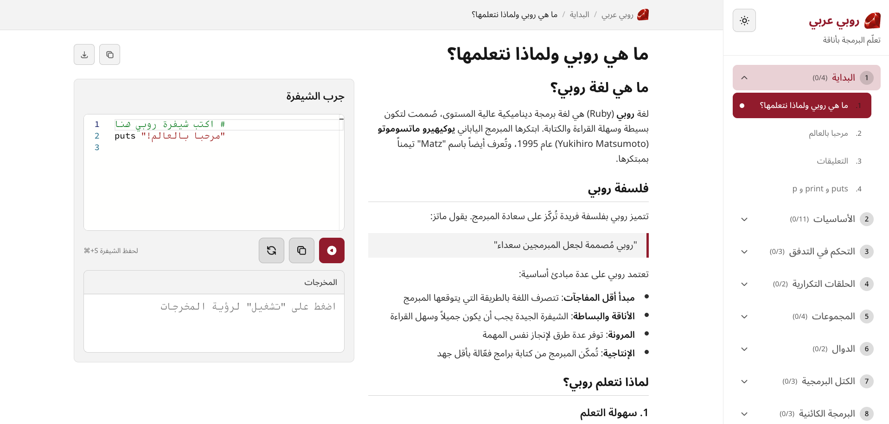

<p align="center">
  
</p>

<h1 align="center">Ruby3araby</h1>

<p align="center">
  <strong>تعلم لغة روبي باللغة العربية</strong><br>
  Learn Ruby Programming in Arabic
</p>

<p align="center">
  <a href="#features">Features</a> •
  <a href="#demo">Demo</a> •
  <a href="#getting-started">Getting Started</a> •
  <a href="#tech-stack">Tech Stack</a> •
  <a href="#project-structure">Project Structure</a> •
  <a href="#contributing">Contributing</a> •
  <a href="#license">License</a>
</p>

<p align="center">
  
  
  
  
  
  <br>
  <a href="https://app.netlify.com/projects/ruby3araby/deploys">
    
  </a>
</p>

---

## Overview

**Ruby3araby** (روبي عربي) is a free, interactive Ruby programming course designed for Arabic speakers. The entire course runs directly in the browser using [Ruby WASM](https://github.com/ruby/ruby.wasm) — no installation, no backend, no setup required.

Write, run, and learn Ruby code instantly with comprehensive Arabic explanations, progressive exercises, and real-time feedback.

<p align="center">
  
  <br>
  <em>Interactive code editor with Arabic lessons and instant execution</em>
</p>

## Features

- **100% Browser-Based** — Ruby code executes entirely in the browser via WebAssembly. No server, no installation.
- **Arabic-First Content** — Complete curriculum written in Arabic with RTL support throughout the interface.
- **Interactive Code Editor** — Monaco Editor with Ruby syntax highlighting, real-time syntax checking, and keyboard shortcuts.
- **Progressive Exercises** — Each lesson includes hands-on exercises with expected output validation and progressive hints.
- **Progress Tracking** — Automatic progress saving to localStorage. Pick up where you left off.
- **Dark/Light Themes** — Full theme support with system preference detection.
- **Mobile Friendly** — Responsive design with touch-friendly controls.
- **Offline Capable** — WASM binary is cached for faster subsequent loads.

### Course Topics

| Section | Topics Covered |
|---------|---------------|
| **البداية** (Getting Started) | Hello World, Comments, Output Methods |
| **الأساسيات** (Fundamentals) | Variables, Data Types, Operators, Strings, User Input |
| **التحكم في التدفق** (Control Flow) | Conditionals, Case/When, Ternary Operator |
| **الحلقات** (Loops) | While, Until, For, Loop Control |
| **المجموعات** (Collections) | Arrays, Hashes, Ranges, Enumerables |
| **الدوال** (Methods) | Defining Methods, Return Values, Splat Operators |
| **الكتل** (Blocks) | Block Syntax, Yield, Procs & Lambdas |
| **البرمجة الكائنية** (OOP) | Classes, Objects, Inheritance, Modules |
| **معالجة الأخطاء** (Error Handling) | Begin/Rescue/End, Custom Errors |
| **التحديات** (Challenges) | FizzBuzz, Calculator, Guessing Game |

## Getting Started

### Prerequisites

- [Node.js](https://nodejs.org/) 18.x or higher
- npm, yarn, or pnpm

### Installation

```bash
# Clone the repository
git clone https://github.com/yourusername/ruby3araby.git
cd ruby3araby

# Install dependencies
npm install

# Start development server
npm run dev
```

Open [http://localhost:3000](http://localhost:3000) in your browser.

### Available Scripts

| Command | Description |
|---------|-------------|
| `npm run dev` | Start development server with hot reload |
| `npm run build` | Create optimized production build |
| `npm run start` | Start production server |
| `npm run lint` | Run ESLint |
| `npm run typecheck` | Run TypeScript type checking |

## Tech Stack

| Technology | Purpose |
|------------|---------|
| [Next.js 16](https://nextjs.org/) | React framework with App Router |
| [React 19](https://react.dev/) | UI library |
| [TypeScript 5](https://www.typescriptlang.org/) | Type safety |
| [Ruby WASM](https://github.com/ruby/ruby.wasm) | Browser-based Ruby execution |
| [Monaco Editor](https://microsoft.github.io/monaco-editor/) | Code editor (VS Code's editor) |
| [Tailwind CSS 4](https://tailwindcss.com/) | Styling with RTL support |
| [Shiki](https://shiki.style/) | Syntax highlighting for lesson content |

## Project Structure

```
ruby3araby/
├── app/                          # Next.js App Router
│   ├── page.tsx                  # Homepage
│   ├── layout.tsx                # Root layout with providers
│   ├── lessons/[section]/[lesson]/ # Dynamic lesson pages
│   ├── glossary/                 # Programming terminology
│   └── progress/                 # User progress page
│
├── components/                   # React components
│   ├── CodePlayground.tsx        # Interactive code editor + runner
│   ├── CodeEditor.tsx            # Monaco editor wrapper
│   ├── Sidebar.tsx               # Course navigation
│   └── ThemeToggle.tsx           # Dark/light theme switcher
│
├── lib/                          # Core utilities
│   ├── ruby-runner.ts            # Ruby WASM singleton service
│   ├── course-loader.ts          # Course structure utilities
│   ├── progress.ts               # localStorage progress service
│   └── types.ts                  # TypeScript type definitions
│
├── content/                      # Course content
│   ├── course.json               # Course structure definition
│   ├── glossary.json             # Programming terms glossary
│   └── lessons/                  # Markdown lesson files
│       ├── getting-started/
│       ├── fundamentals/
│       ├── control-flow/
│       └── ...
│
└── public/                       # Static assets
```

## How It Works

### Ruby Execution

1. **Lazy Loading**: The Ruby WASM module (~20MB) is loaded only when the user first runs code.

2. **Caching**: The WASM binary is cached using the Cache API for instant subsequent loads.

3. **Sandboxed Execution**: Code runs in an isolated WebAssembly environment with captured stdout/stderr.

4. **Input Simulation**: `gets` calls are simulated using pre-defined input values for exercises.

### Progress Persistence

- Progress is stored in `localStorage` with the `ruby3araby_` prefix
- Tracks: completed lessons, last visited lesson, saved code per lesson
- Code auto-saves with 1-second debounce
- Cross-tab synchronization via custom events

## Contributing

Contributions are welcome! Here's how you can help:

### Adding/Improving Lessons

1. Lesson content lives in `content/lessons/{section}/{lesson}.md`
2. Update `content/course.json` to register new lessons
3. Each lesson can include an exercise with:
   - `starterCode`: Initial code template
   - `expectedOutput`: Expected output for validation
   - `hints`: Progressive hints (revealed one at a time)
   - `defaultInput`: Simulated input for `gets` calls

### Development Guidelines

- Follow existing code patterns and naming conventions
- Use TypeScript for all new code
- Ensure RTL compatibility for Arabic content
- Test on both desktop and mobile viewports
- Run `npm run lint` and `npm run typecheck` before submitting

### Pull Request Process

1. Fork the repository
2. Create a feature branch (`git checkout -b feature/amazing-feature`)
3. Commit your changes (`git commit -m 'Add amazing feature'`)
4. Push to the branch (`git push origin feature/amazing-feature`)
5. Open a Pull Request

## Roadmap

- [ ] Additional advanced Ruby topics
- [ ] Interactive quizzes
- [ ] Certificate of completion
- [ ] PWA support for offline access
- [ ] Community discussion features
- [ ] Video lesson supplements

## License

This project is licensed under the MIT License — see the [LICENSE](LICENSE) file for details.

## Acknowledgments

- [Ruby WASM](https://github.com/ruby/ruby.wasm) team for making Ruby run in the browser
- [Matz](https://en.wikipedia.org/wiki/Yukihiro_Matsumoto) and the Ruby community for creating such an elegant language
- The Arabic developer community for inspiration and feedback

---

<p align="center">
  Made with ❤️ for Arabic-speaking developers
  <br>
  <strong>روبي عربي</strong> — تعلم البرمجة باللغة العربية
</p>
